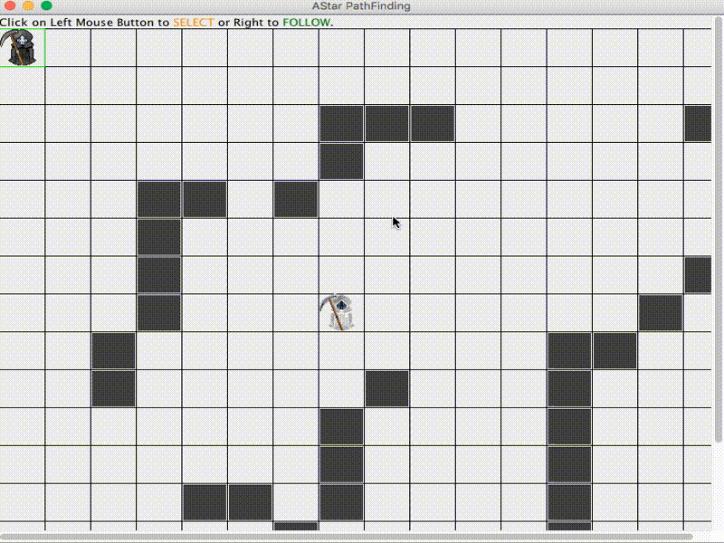

# Java Data Structure Algoritms

DSA using Java


## Prerequires

1. Git 2.6+
2. Maven 3+
3. Java 8+


## How to Play

Clone

```
git clone https://github.com/humbertodias/java-data-structures-algorithms.git
```

Inside the folder

```
cd java-data-structures-algorithms
```

Run

```
mvn compile exec:java -Dexec.mainClass="astar.Main"
```



## References

[A* Search Algorithm](https://en.wikipedia.org/wiki/A*_search_algorithm)

